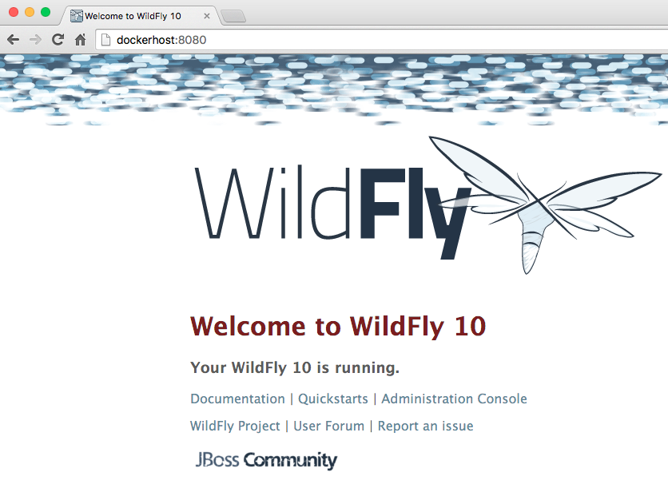
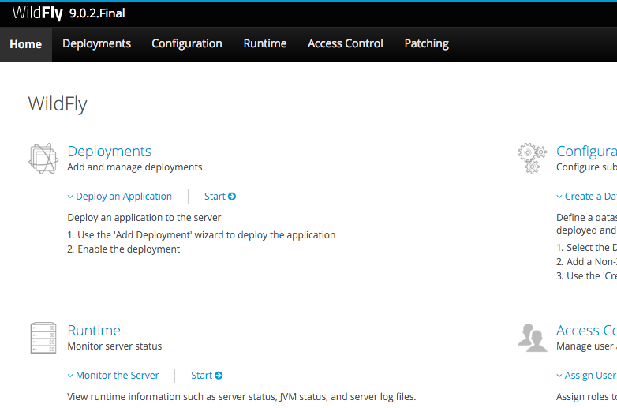

## Run Container

The first step in running any application on Docker is to run a container from an image. There are plenty of images available from the official Docker registry (aka https://hub.docker.com[Docker Hub]). To run any of them, you just have to ask the Docker Client to run it. The client will check if the image already exists on Docker Host. If it exists then it'll run it, otherwise the host will download the image and then run it.

### Pull Image

Let's first check, if any images are available:

[source, text]
----
docker images
----

At first, this list only contains the Docker swarm image, we used earlier.

[source, text]
----
REPOSITORY                           TAG                 IMAGE ID            CREATED             VIRTUAL SIZE
classroom.example.com:5000/swarm     latest              556c60f87888        33 hours ago        10.2 MB----
----

Now, let's get a vanilla `jboss/wildfly` image:

[source, text]
----
docker pull classroom.example.com:5000/wildfly:latest
----

By default, docker images are retrieved from https://hub.docker.com/[Docker Hub]. In our case, we're providing a so called private registry via the instructor laptop.

You can see, that Docker is downloading the image with it's different layers.

[NOTE]
====
In a traditional Linux boot, the Kernel first mounts the root File System as read-only, checks its integrity, and then switches the whole rootfs volume to read-write mode.
When Docker mounts the rootfs, it starts read-only, as in a traditional Linux boot, but then, instead of changing the file system to read-write mode, it takes advantage of a union mount to add a read-write file system over the read-only file system. In fact there may be multiple read-only file systems stacked on top of each other. Consider each one of these file systems as a layer.

At first, the top read-write layer has nothing in it, but any time a process creates a file, this happens in the top layer. And if something needs to update an existing file in a lower layer, then the file gets copied to the upper layer and changes go into the copy. The version of the file on the lower layer cannot be seen by the applications anymore, but it is there, unchanged.

We call the union of the read-write layer and all the read-only layers a _union file system_.

.Docker Layers
image::plain-wildfly0.png[]
====

In our particular case, the https://github.com/jboss-dockerfiles/wildfly/blob/9.0.1.Final/Dockerfile[jboss/wildfly] image extends the https://github.com/jboss-dockerfiles/base-jdk/blob/jdk8/Dockerfile[jboss/base-jdk:8] image which adds the OpenJDK distribution on top of the https://github.com/jboss-dockerfiles/base/blob/master/Dockerfile[jboss/base] image.
The base image is used for all JBoss community images. It provides a base layer that includes:

. A jboss user (uid/gid 1000) with home directory set to `/opt/jboss`
. A few tools that may be useful when extending the image or installing software, like unzip.

The "`jboss/base-jdk:8`" image adds:

. OpenJDK 8 distribution
. Adds a `JAVA_HOME` environment variable

When the download is done, you can list the images again and will see the following:

[source, text]
----
docker images
REPOSITORY                           TAG                 IMAGE ID            CREATED             VIRTUAL SIZE
classroom.example.com:5000/wildfly   latest              7688aaf382ab        6 weeks ago         581.4 MB
classroom.example.com:5000/swarm     latest              207e8b983242        9 weeks ago         10.2 MB
----

### Run Container
For now, all we did is pull the container description (aka image) down to our local laptops. Now we want to actually run an instance of the image as a so called "container".

#### Interactive Container
Typically container run in the background. They are launched and forgotten. And this is the default behaviour for Docker.
But there is a way we can make them behave like an instance with an interactive console.
To run the WildFly container in an interactive mode.

[source, text]
----
docker run -it classroom.example.com:5000/wildfly
----

This will show the output as:

[source, text]
----
=========================================================================

  JBoss Bootstrap Environment

  JBOSS_HOME: /opt/jboss/wildfly

  JAVA: /usr/lib/jvm/java/bin/java

  JAVA_OPTS:  -server -XX:+UseCompressedOops  -server -XX:+UseCompressedOops -Xms64m -Xmx512m -XX:MaxPermSize=256m -Djava.net.preferIPv4Stack=true -Djboss.modules.system.pkgs=org.jboss.byteman -Djava.awt.headless=true

=========================================================================

OpenJDK 64-Bit Server VM warning: ignoring option MaxPermSize=256m; support was removed in 8.0
17:02:58,000 INFO  [org.jboss.modules] (main) JBoss Modules version 1.4.3.Final
17:02:58,251 INFO  [org.jboss.msc] (main) JBoss MSC version 1.2.6.Final
17:02:58,311 INFO  [org.jboss.as] (MSC service thread 1-2) WFLYSRV0049: WildFly Full 9.0.1.Final (WildFly Core 1.0.1.Final) starting
17:02:59,558 INFO  [org.jboss.as.controller.management-deprecated] (ServerService Thread Pool -- 11) WFLYCTL0028: Attribute 'job-repository-type' in the resource at address '/subsystem=batch' is deprecated, and may be removed in future version. See the attribute description in the output of the read-resource-description operation to learn more about the deprecation.
17:02:59,560 INFO  [org.jboss.as.controller.management-deprecated] (ServerService Thread Pool -- 3) WFLYCTL0028: Attribute 'enabled' in the resource at address '/subsystem=datasources/data-source=ExampleDS' is deprecated, and may be removed in future version. See the attribute description in the output of the read-resource-description operation to learn more about the deprecation.
...
17:03:00,610 INFO  [org.wildfly.extension.undertow] (MSC service thread 1-2) WFLYUT0006: Undertow HTTP listener default listening on /0.0.0.0:8080
17:03:00,715 INFO  [org.jboss.as.connector.subsystems.datasources] (MSC service thread 1-2) WFLYJCA0001: Bound data source [java:jboss/datasources/ExampleDS]
17:03:00,881 INFO  [org.jboss.ws.common.management] (MSC service thread 1-1) JBWS022052: Starting JBoss Web Services - Stack CXF Server 5.0.0.Final
17:03:00,891 INFO  [org.jboss.as.server.deployment.scanner] (MSC service thread 1-2) WFLYDS0013: Started FileSystemDeploymentService for directory /opt/jboss/wildfly/standalone/deployments
17:03:01,131 INFO  [org.jboss.as] (Controller Boot Thread) WFLYSRV0060: Http management interface listening on http://127.0.0.1:9990/management
17:03:01,133 INFO  [org.jboss.as] (Controller Boot Thread) WFLYSRV0051: Admin console listening on http://127.0.0.1:9990
17:03:01,138 INFO  [org.jboss.as] (Controller Boot Thread) WFLYSRV0025: WildFly Full 9.0.1.Final (WildFly Core 1.0.1.Final) started in 3431ms - Started 203 of 379 services (210 services are lazy, passive or on-demand)
----

This shows that the server started correctly, congratulations!

The switches do the following: `-i` allows to interact with the STDIN and `-t` attach a TTY to the process. Switches can be combined together and used as `-it`.

Hit Ctrl+C to stop the container.

#### Detached Container

Restart the container in detached mode:

[source, text]
----
docker run --name mywildfly -d classroom.example.com:5000/wildfly
972f51cc8422eec0a7ea9a804a55a2827b5537c00a6bfd45f8646cb764bc002a
----

`-d`, instead of `-it`, runs the container in detached mode.

The output is the unique id assigned to the container. You can use it to refer to the container in various contexts. Check the logs as:

[source, text]
----
> docker logs 972f51cc8422eec0a7ea9a804a55a2827b5537c00a6bfd45f8646cb764bc002a
=========================================================================

  JBoss Bootstrap Environment

  JBOSS_HOME: /opt/jboss/wildfly

. . .
----

We can check it by issuing the `docker ps` command which retrieves the images process which are running and the ports engaged by the process:

[source, text]
----
> docker ps
CONTAINER ID        IMAGE                                COMMAND                CREATED              STATUS              PORTS               NAMES
7da1c7614edf        classroom.example.com:5000/wildfly   "/opt/jboss/wildfly/   About a minute ago   Up About a minute   8080/tcp            mywildfly
----

Noticed the "NAMES" column? This is a quick way of refering to your container. Let's try to look at the logs again:

[source, text]
----
docker logs mywildfly
----

That looks easier.

Also try `docker ps -a` to see all the containers on this machine.

### Run Container with Default Port

Startup log of the server shows that the server is located in the `/opt/jboss/wildfly`. It also shows that the public interfaces are bound to the `0.0.0.0` address while the admin interfaces are bound just to `localhost`. This information will be useful to learn how to customize the server.

`docker-machine ip <machine-name>` gives us the Docker Host IP address and this was already added to the hosts file. So, we can give it another try by accessing: http://dockerhost:8080. However, this will not work either.

If you want containers to accept incoming connections, you will need to provide special options when invoking `docker run`. The container, we just started, can't be accessed by our browser. We need to stop it again and restart with different options.

[source, text]
----
docker stop mywildfly
----

Restart the container as:

[source, text]
----
docker run --name mywildfly-exposed-ports -d -P classroom.example.com:5000/wildfly
----

`-P` map any exposed ports inside the image to a random port on the Docker host. This can be verified as:

[source, text]
----
> docker ps
CONTAINER ID        IMAGE                                    COMMAND                CREATED             STATUS              PORTS                     NAMES
7f41a5a0cfd6        classroom.example.com:5000/wildfly   "/opt/jboss/wildfly/   52 seconds ago      Up 52 seconds       0.0.0.0:32768->8080/tcp   mywildfly-exposed-ports
----

The port mapping is shown in the `PORTS` column. Access the WildFly server at http://dockerhost:32768. Make sure to use the correct port number as shown in your case.

NOTE: Exact port number may be different in your case.

### Run Container with Specified Port

Lets stop the previously running container as:

[source, text]
----
docker stop mywildfly-exposed-ports
----

Restart the container as:

[source, text]
----
docker run --name mywildfly-mapped-ports -d -p 8080:8080 classroom.example.com:5000/wildfly
----

The format is `-p hostPort:containerPort`. This option maps container ports to host ports and allows other containers on our host to access them.

.Docker Port Mapping
[NOTE]
===============================
Port exposure and mapping are the keys to successful work with Docker.
See more about networking on the Docker website link:https://docs.docker.com/articles/networking/[Advanced Networking]
===============================

Now we're ready to test http://dockerhost:8080 again. This works with the exposed port, as expected.

Lets stop the previously running container as:

[source, text]
----
docker stop mywildfly-mapped-ports
----

.Welcome WildFly

[[Enabling_WildFly_Administration]]
### Enabling WildFly Administration

Default WildFly image exposes only port 8080 and thus is not available for administration using either the CLI or Admin Console. Lets expose the ports in different ways.

#### Default Port Mapping

The following command will override the default command in Docker file, start WildFly, and bind application and management port to all network interfaces.

[source, text]
----
docker run --name managed-wildfly -P -d classroom.example.com:5000/wildfly /opt/jboss/wildfly/bin/standalone.sh -b 0.0.0.0 -bmanagement 0.0.0.0
----

Accessing WildFly Administration Console require a user in administration realm. A pre-created image, with appropriate username/password credentials, is used to start WildFly as:

[source, text]
----
docker run --name managed-wildfly-from-image -P -d classroom.example.com:5000/wildfly-management
----

`-P` map any exposed ports inside the image to a random port on Docker host.

Look at the exposed ports as:

[source, text]
----
docker ps
CONTAINER ID        IMAGE                                           COMMAND                CREATED             STATUS              PORTS                                              NAMES
5fdedef5573b        classroom.example.com:5000/wildfly-management   "/bin/sh -c '/opt/jb   15 seconds ago      Up 15 seconds       0.0.0.0:32772->8080/tcp, 0.0.0.0:32771->9990/tcp   managed-wildfly-from-image
ee30433b5414        classroom.example.com:5000/wildfly              "/opt/jboss/wildfly/   59 seconds ago      Up 59 seconds       0.0.0.0:32769->8080/tcp                            managed-wildfly
----

Look for the host port that is mapped in the container, `32769` in this case. Access the admin console at http://dockerhost:32769.

NOTE: Exact port number may be different in your case.

The username/password credentials are:

[[WildFly_Administration_Credentials]]
[options="header"]
|====
| Field | Value
| Username | admin
| Password | docker#admin
|====

This shows the admin console as:

.Welcome WildFly

##### Additional Ways To Find Port Mapping

The exact mapped port can also be found as:

. Using `docker port`:
+
[source, text]
----
docker port managed-wildfly-from-image
----
+
to see the output as:
+
[source, text]
----
0.0.0.0:32769->8080/tcp
0.0.0.0:32770->9990/tcp
----
+
. Using `docker inspect`:
+
[source, text]
----
docker inspect --format='{{(index (index .NetworkSettings.Ports "9990/tcp") 0).HostPort}}' managed-wildfly-from-image
----

[[Management_Fixed_Port_Mapping]]
#### Fixed Port Mapping

This management image can also be started with a pre-defined port mapping as:

[source, text]
----
docker run -p 8080:8080 -p 9990:9990 -d classroom.example.com:5000/wildfly-management
----

In this case, Docker port mapping will be shown as:

[source, text]
----
8080/tcp -> 0.0.0.0:8080
9990/tcp -> 0.0.0.0:9990
----

### Stop and Remove Container

#### Stop Container

. Stop a specific container:
+
[source, text]
----
docker stop <CONTAINER ID>
----
+
. Stop all the running containers
+
[source, text]
----
docker stop `docker ps -aq`
----
+
. Stop only the exited containers
+
[source, text]
----
docker ps -a -f "exited=-1"
----

#### Remove Container

. Remove a specific container:
+
[source, text]
----
docker rm 0bc123a8ece0
----
+
. Remove containers meeting a regular expression
+
[source, text]
----
docker ps -a | grep wildfly | awk '{print $1}' | xargs docker rm
----
+
. Remove all containers, without any criteria
+
[source, text]
----
docker rm `docker ps -aq`
----
